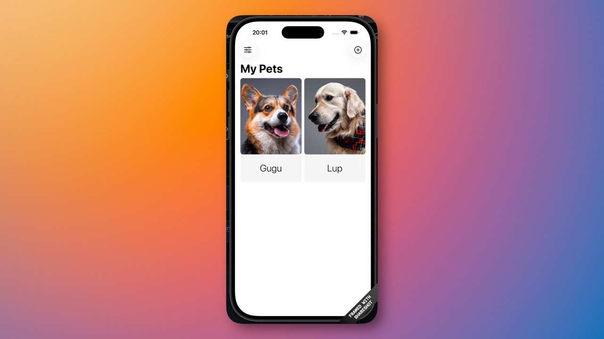

# gnix_paws 🐾

**gnix_paws** é um aplicativo iOS desenvolvido em SwiftUI para gerenciar e acompanhar seus animais de estimação. O projeto utiliza o framework **SwiftData** para persistência de dados local, oferecendo uma experiência fluida e integrada ao ecossistema Apple.

## 🚀 Funcionalidades

- **Adicionar Pets**: Cadastre novos animais com nome e foto.
- **Listar Pets**: Visualize todos os seus pets em um layout de grade moderno.
- **Editar Pets**: Atualize as informações e fotos dos seus animais.
- **Excluir Pets**: Remova registros com facilidade através de uma interface intuitiva.
- **Persistência Local**: Todos os dados são salvos localmente usando SwiftData.

## 🛠️ Tecnologias Utilizadas

- **SwiftUI**: Interface declarativa e moderna.
- **SwiftData**: Gerenciamento e persistência de modelos de dados.
- **PhotosUI**: Integração com a biblioteca de fotos do sistema.
- **SF Symbols**: Ícones nativos da Apple.

## 📂 Estrutura do Projeto

- `ContentView.swift`: Visão principal que exibe a lista de pets em uma grade.
- `EditPetView.swift`: Interface para edição de detalhes e seleção de fotos.
- `Pet.swift`: Modelo de dados (Schema) estruturado com SwiftData.
- `CustomUnavailableView.swift`: Componente para estados vazios ou buscas sem resultados.

## 📸 Screenshots

_(Verifique a pasta `screenshots` para referências visuais da interface.)_

## ⚙️ Como Executar

1. Certifique-se de ter o **Xcode 15+** instalado.
2. Clone este repositório.
3. Abra o arquivo `gnix_paws.xcodeproj`.
4. Selecione um simulador ou dispositivo físico (iOS 17+).
5. Compile e execute (`Cmd + R`).

---

Desenvolvido por Davi Gomes Florencio.
